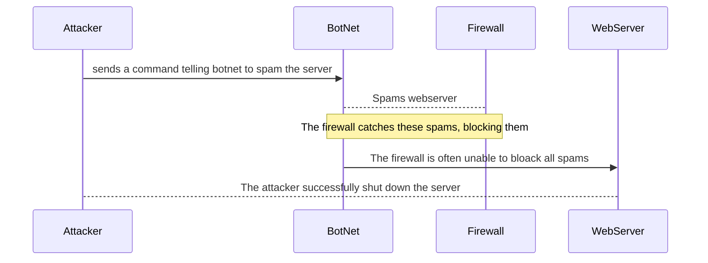

## DDoS Attack

## Documentation
First the attacker will send a command to the botnet to spam the webserver with requests.
Overloading the webserver with requests could cause it to crash due to being overwhelmed. 
The firewall is their to detect that these requests are attacks and spams then block them.
Sometimes however the firewall is unsuccessful in blocking all the spams. 
If enough spams are not blocked and reach the server it can get overwhelmed and crash. 