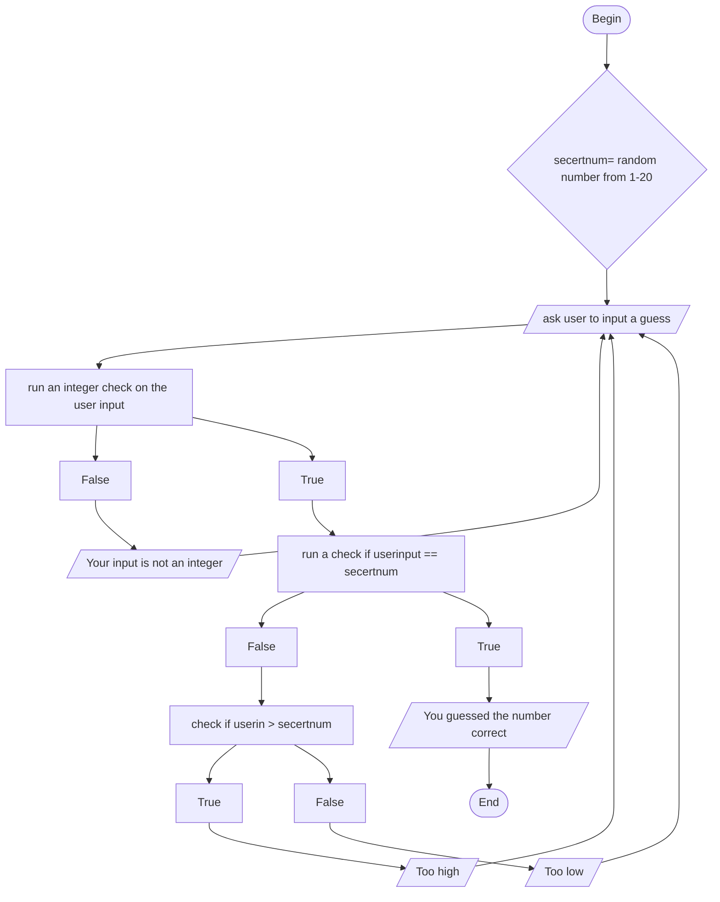

## Guessing

## Documentation
This starts off by first generating the random number. Then asking for the user to input their first guess. Afterwards multiple checks will be run on the users guess. Firt check is to ensure that the input is an integer, so making
sure that the input does not have any charachters or decimals. If it is not an integer the code prompts the user for another guess and goes back to the beginning of the loop. If it is an integer it goes to the second check. The second check  is to see if the user guessed the number correctly. If it is correct the user is let known that they guessed correct and the game ends. If the guess isnt correct, then the code goes to the third check. The third check is to see if the users guess is greater than the secert number. If it is then the code lets the user know that their guess is too high. If their guess is not greater than the secert number that means it is less than the secert number which the code will then let the user know that their guess is to low. After letting the user know if their guess is too low or too high the code will prompt the user to guess again putting them back at the beginning of the loop. This is a loop which will continue to ask the user for guesses until they guess the number. 
 
