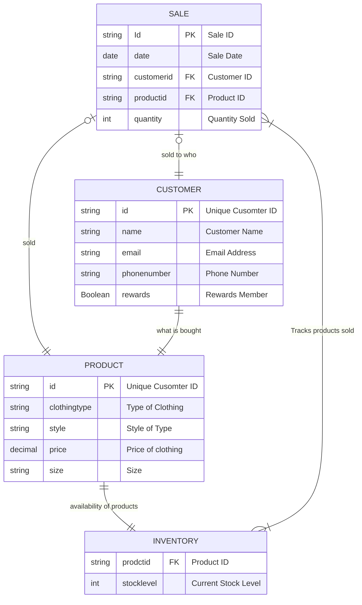

## Levis Entity-Relationship Diagram 

## Documentation 
This is an entity-relationship diagram for the Levis store. There are four entities; product, customer, sale, and inventory. Each ones have relationships with eachother that help support bussiness operations. The sale and customer have relationship that show frequent customers or potential customers that have bought or want to buy which can help with advertising. The sales and inventory have relationship of keeping track what is getting sold or is in high demand and what isnt getting sold, which can help with future clothing launches and can help with stock to ensure nothing out of stock is being sold. Sale and products have a relationship because they need to ensure the correct products are being sold and what products do well and dont. The customer and product have relationship because they need to know what to advertise to that customer based on what they buy. Customer and inventory have a relationship because they need to ensure a customer doesnt buy something out of stock. Product and inventory have a relationship that ensures that ist easy to keep track of prodcut availability. These all work together to ensure that Levis know how to advertise, keep track of products, and help for future launches.  